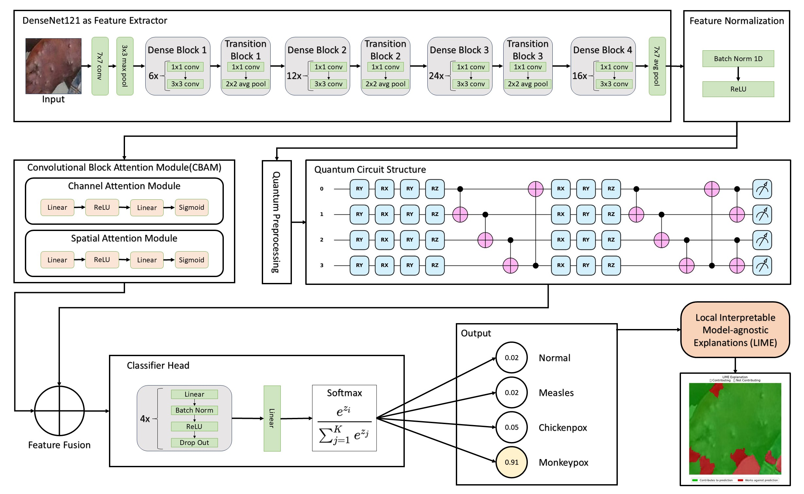

# XDenseQNet: Hybrid Quantum Neural Network for Skin Lesion Classification

> A hybrid quantum-classical deep learning framework combining DenseNet121, CBAM attention, and a parameterised quantum circuit for multi-class skin lesion classification on the MSLD v2.0 dataset.

[](LICENSE)
[]()
[]()
[]()

---

## Abstract

We propose **XDenseQNet**, a hybrid quantum-classical neural network for multi-class skin lesion classification. The method integrates a DenseNet121 backbone with a Convolutional Block Attention Module (CBAM) and a 4-qubit, 2-layer parameterised quantum circuit. Classical features extracted by the CNN are refined through attention, compressed and encoded into the quantum circuit via RY angle encoding, and the resulting PauliZ expectation values are concatenated with the classical features for final classification. Evaluated on the MSLD v2.0 (Monkeypox Skin Lesion Dataset), XDenseQNet achieves **95.83% accuracy** and **0.9945 ROC-AUC**, outperforming seven classical and quantum baselines across all metrics.

---

## Architecture

**Proposed Method**: Input Image &rarr; DenseNet121 Backbone &rarr; CBAM Attention &rarr; Quantum Feature Extraction (4 qubits, 2 layers) &rarr; Feature Concatenation &rarr; Dense Classifier &rarr; Prediction



---

## Results

### Proposed Method vs. Backbone Comparisons (4Q-2L Configuration)

| Model | Accuracy | F1 | Precision | Recall | ROC-AUC | Inference (ms) |
|-------|----------|-----|-----------|--------|---------|----------------|
| **XDenseQNet (Ours)** | **95.83%** | **0.9470** | **0.9468** | **0.9531** | **0.9945** | **9.85** |
| ConvNeXt-Tiny + 4Q-2L | 94.17% | 0.9350 | — | — | 0.9937 | — |
| EfficientNet-B0 + 4Q-2L | 92.50% | 0.9140 | — | — | 0.9868 | — |
| MobileNet-V2 + 4Q-2L | 92.50% | 0.9066 | — | — | 0.9945 | — |
| ResNet50 + 4Q-2L | 90.83% | 0.8902 | — | — | 0.9917 | — |
| Swin-Tiny + 4Q-2L | 90.00% | 0.8732 | — | — | 0.9705 | — |
| ResNet18 + 4Q-2L | 88.33% | 0.8571 | — | — | 0.9825 | — |
| VGG16 + 4Q-2L | 87.50% | 0.8503 | — | — | 0.9745 | — |

### Ablation Study

| Variant | Description | Accuracy | F1 | ROC-AUC |
|---------|-------------|----------|-----|---------|
| **Full (Ours)** | DenseNet121 + CBAM + 4Q-2L QNN | **95.83%** | **0.9470** | **0.9945** |
| A1 | DenseNet121 + CBAM + Dense Head (no QNN) | 90.00% | 0.8849 | 0.9792 |
| A2 (SVM-RBF) | DenseNet121 + CBAM features → SVM | 82.50% | 0.7747 | 0.9613 |
| A3 | DenseNet121 + Standard Head (no CBAM, no QNN) | 88.33% | 0.8532 | 0.9739 |

*Tested on [MSLD v2.0](https://www.kaggle.com/datasets/nafin59/monkeypox-skin-lesion-dataset). See `results/` for full tables and figures.*

---

## Quick Start

### 1. Clone & Install

```bash
git clone https://github.com/your-username/XDenseQNet.git
cd XDenseQNet
pip install -r requirements.txt
```

### 2. Prepare Data

```bash
# Download MSLD v2.0 from Kaggle:
# https://www.kaggle.com/datasets/nafin59/monkeypox-skin-lesion-dataset
# Place the extracted folders in data/MSLD_v2/

# Run balanced augmentation + train/val/test split:
python train.py --config configs/proposed.yaml --prepare-data --skip-phase1 --device cpu
```

See [`data/README.md`](data/README.md) for detailed dataset setup instructions.

### 3. Train

```bash
# Full two-phase training (proposed method)
python train.py --config configs/proposed.yaml

# Train a specific baseline
python train.py --config configs/baselines/resnet50.yaml

# Skip Phase 1 if backbone is already fine-tuned
python train.py --config configs/proposed.yaml --skip-phase1
```

### 4. Evaluate

```bash
python evaluate.py --checkpoint checkpoints/best.pth --config configs/proposed.yaml
```

This generates confusion matrices, ROC curves, per-class bar charts, and CSV metrics in `results/`.

---

---

## Experiments

All experiments are reproducible via the notebooks in `notebooks/`:

| Notebook | Description |
|----------|-------------|
| [`01_proposed_method.ipynb`](notebooks/01_proposed_method.ipynb) | Trains 8 backbones × 2 quantum configs (4Q-2L, 6Q-3L), produces comparison tables |
| [`02_ablation_study.ipynb`](notebooks/02_ablation_study.ipynb) | Ablation A1 (no QNN), A2 (classical ML), A3 (no CBAM/QNN), with visualisations |

---

## Requirements

See [`requirements.txt`](requirements.txt). Key dependencies:

- Python 3.8+
- PyTorch 2.1+
- PennyLane 0.36+ (quantum circuit simulation)
- torchvision 0.16+
- timm 1.0+ (ConvNeXt, Swin Transformer backbones)
- Albumentations 1.3+ (data augmentation)
- scikit-learn 1.3+

---

## Citation

If you use this code in your research, please cite:

```bibtex
@article{tariq2026xdenseqnet,
  title   = {XDenseQNet: Hybrid Quantum Neural Network for Skin Lesion Classification},
  author  = {Tariq Shehroz, Inayat Umair, Zulfiqar Fatima, Raza Rehan and Arif Muhammad},
  year    = {2026},
  url     = {https://github.com/umairinayat/XDenseQNet}
}
```

---

## License

This project is licensed under the MIT License — see [LICENSE](LICENSE) for details.

---

## Acknowledgements

- [MSLD v2.0 Dataset](https://www.kaggle.com/datasets/nafin59/monkeypox-skin-lesion-dataset) — Monkeypox Skin Lesion Dataset
- [PennyLane](https://pennylane.ai/) — Quantum machine learning framework
- [PyTorch](https://pytorch.org/) — Deep learning framework
- [timm](https://github.com/huggingface/pytorch-image-models) — PyTorch Image Models
